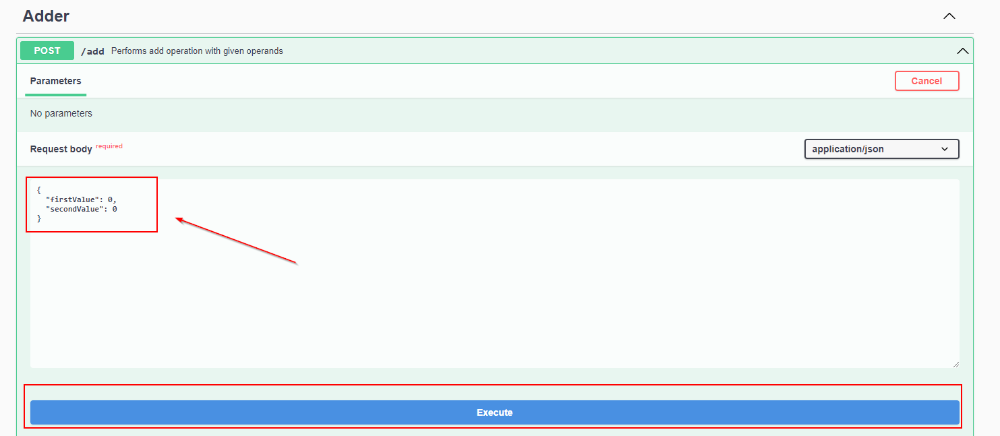

# Calculator Microservice

## Generación del JAR

Para generar el fichero JAR únicamente tenemos que invocar el comando de maven. La integración con la librería Tracer
API está hecha de forma interna.

``
mvn clean package
``

## Ejecución de la aplicación

En primer lugar ejecutamos el siguiente comando:

``
mvn spring-boot:run
``

Una vez arrancado, podemos interactuar de forma sencilla con el API REST desde el siguiente enlace que incluye
documentación sobre la misma.

http://localhost:8080/swagger-ui.html

